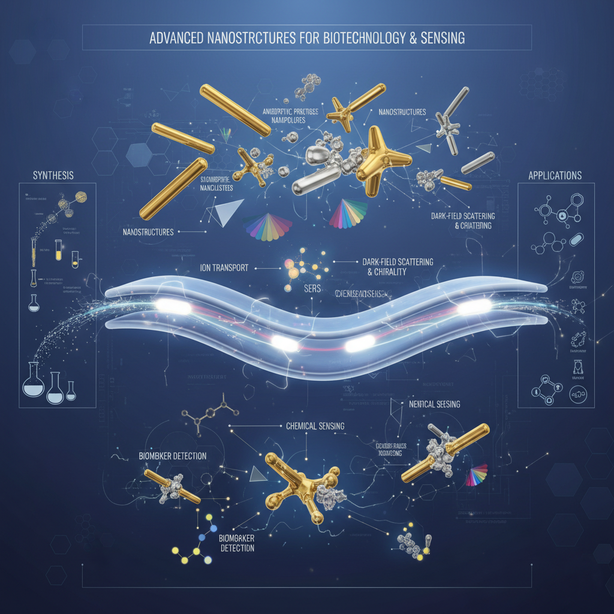

---
format:
  html:
    theme:
      light: flatly
      dark: darkly
    css: styles.css
    toc: false
    page-layout: full
---

:::::::: profile-banner
:::::: banner-text-section
::: prof-details
## Prof. Amrita Chakraborty, Ph.D.

**Assistant Professor**  Department of Chemistry  Birla Institute of Technology & Science, Pilani  (BITS Pilani) \| Hyderabad Campus \| India
:::

::: website-link
**BITS website:** [Click here](https://www.bits-pilani.ac.in/hyderabad/profamritachakraborty/){target="_blank"}
:::

<a href="https://linkedin.com/in/amrita-chakraborty-b69b5aa4/" class="social-btn-modern" aria-label="LinkedIn Profile" title="LinkedIn Profile"> <i class="bi bi-linkedin"></i> </a>

::::::

::: banner-image-section
{alt="Advanced Nanostructures for Biotechnology & Sensing"}
:::
::::::::

## RESEARCH INTERESTS

My primary research interest focuses on creating nanostructures with intriguing physicochemical properties through chemical interactions between nanoparticles of varying sizes, and examining their potential for diverse applications. This includes the synthesis of anisotropic noble metal nanoparticles and atomically precise nanoclusters, their systematic assembly, and the investigation of structural chirality for ultrasensitive biomarker detection. My current research investigates the molecular organization of interfaces and the mechanism of ion transport through lipid membranes using nonlinear optical spectroscopy.

## PROFESSIONAL EXPERIENCE

**Postdoctoral Scholar**\
*Interface Science Lab, Department of Chemistry, Texas A&M University, Texas, USA (2025 - Present)*\
Advisor: Prof. Saranya Pullanchery

**Postdoctoral Scholar**\
*Nanobiengineering Lab, Department of Mechanical Engineering, University of Texas at Dallas, Texas, USA (2023 - 2024)*\
Advisor: Prof. Zhenpeng Qin

**Postdoctoral Scholar**\
*Department of Chemistry, Rice University, Texas, USA (2021 - 2023)*\
Advisor: Prof. Stephan Link

## EDUCATION

**Ph.D., Chemistry**\
*Indian Institute of Technology Madras, Chennai, India (2015 - 2021)*\
Thesis: *Chemical Interactions Between Nanoscale Systems: Novel Structures and Emerging Properties*\
Advisor: Prof. Thalappil Pradeep

**M.Sc., Chemistry**\
*Jadavpur University, Kolkata, India (2013 - 2015)*\
Advisor: Prof. Nitin Chattopadhyay

**B.Sc., Chemistry**\
*Jadavpur University, Kolkata, India (2009 - 2013)*

## FELLOWSHIPS, AWARDS, & GRANTS

-   **Provost's Office Postdoctoral Appreciation Award**, University of Texas at Dallas (2024)
-   **Institute Research Award**, IIT Madras (2021)
-   **Best Oral Talk Award**, Virtual National Conference on Materials for Energy Harvesting and Catalysis (2020)
-   **Best Poster Award**, Chemistry In-House Symposium (CHIS-2018), IIT Madras (2018)
-   **CSIR UGC NET Fellowship** for doctoral research (All India Rank 74) (2015-2020)
-   **Indira Gandhi Single Girl Child Scholarship**, Govt. of India (2013-2015)
-   **INSPIRE Scholarship**, Department of Science and Technology, Govt. of India (2010-2015)

## TEACHING & MENTORING

**Teaching Experience**

-   Guest Lecture on "Optical properties of materials: Fluorescence and Chirality", University of Texas at Dallas (2024)
-   Graduate Teaching Assistant for "Quantum Mechanics" and "Lab-based Experimental Chemistry", IIT Madras (2016-2017)

**Mentoring Experience**

-   Mentored Anabela Meier (Masters' student, Texas A&M University) for 2025 summer research program
-   Mentored a group of high school students for 'PACE Research program for minors', UT Dallas (2023-2024)
-   Mentored Alison Carroll (REU student, Rice University, Summer 2022), who won a best poster award
-   Mentored summer interns at IIT Madras (Megha Maria Stanley, 2020; Harsh Dave, 2019), leading to co-authored publications

## ARTICLES REVIEWED

-   Review activity for *Advanced Materials* (I.F. 27.4)
-   Review activity for *Laser and Photonics Reviews* (I.F. 9.8)
-   Review activity for *Open Chemistry* (I.F. 2.3)

## SEMINARS/CONFERENCES/WORKSHOPS ATTENDED

**Poster Presentations**

-   "Morphological evaluation of bioaerosols with compositional complexity", University of Texas System Postdoctoral Symposium, USA (2024)
-   "Single Particle Chirality Studies of DNA-templated Gold Nanorod Dimers", GRC on Noble Metal Nanoparticles, USA (2022)
-   "Atomically Precise Nanocluster Assemblies Encapsulating Plasmonic Gold Nanorods", GRC on Noble Metal Nanoparticles, USA (2019) & ICONSAT, India (2018)
-   "Systematic Self-Assembly of Ag44 Clusters on Reconstructed Gold Nanorod Surface", International Symposium on Monolayer-Protected Clusters, Switzerland (2017)

**Oral Presentation**

-   "Noble metal nanocomposites: Advanced materials for catalysis" (Awarded Best Oral Talk), Virtual National Conference on Materials for Energy Harvesting and Catalysis (2020)
